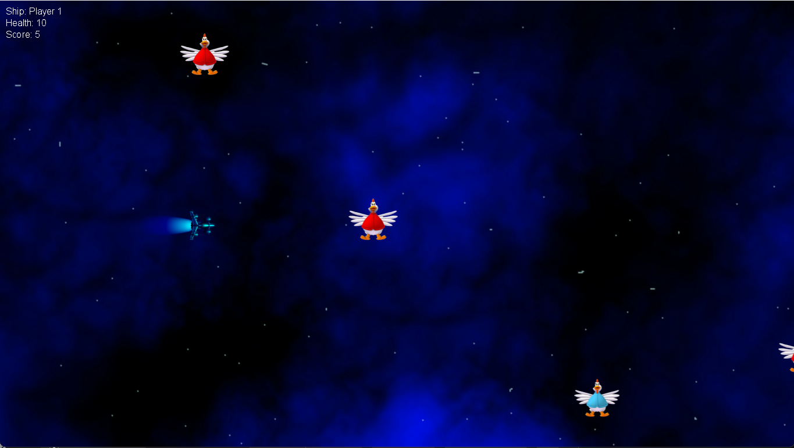
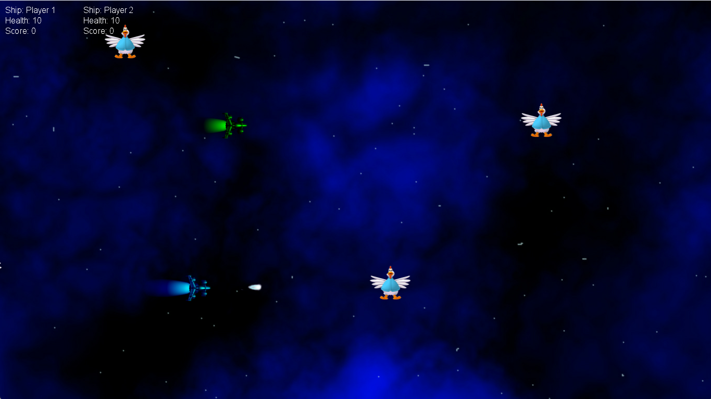

# Kentucky Fried Chicken - 2D Space Shooter
Monogame mobile dev project.

## Dependencies ##

The project runs on **VS 2019**.

## Features ##

Here's a list of the gameplay features

### Gameplay ###

- W,A,S,D movement for player 1.
- Arrow keys movement for player 2.
- +1 point per enemy.
- -1 point per collision.

### User interface ###

- An menu to choose from single, multiplayer, reviewing high scores, or to exit the game.
- A score board located top left of the screen.

### Visual effects ###

- Layered particle systems like explosions, flying bullets, and music.